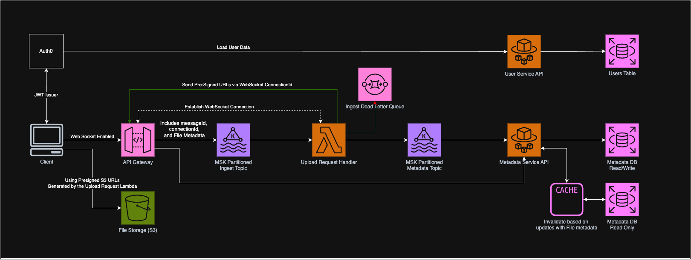

# Scalable File Upload Service – System Design

## 1. Understand the Problem

**Goal:** Design a scalable, backend-focused file upload service.

### Functional Requirements
- Users can upload files up to **100 MB**.
- Users can retrieve a list of and download **all their uploaded files**.
- Files can be **public** or **private**.
- Upload progress must be **trackable**.
- System requires **login/authentication**.
- **Premium tier** users:
    - May upload larger files.
    - Get higher upload concurrency or priority processing.

### Assumptions
- Supports **thousands of concurrent users**.
- Presigned URLs will be used for direct S3 uploads/downloads.
- The System is built using mostly **serverless and event-driven architecture**.
- Authentication handled by **Auth0** or similar service.
---

## 2. Sketch the System

- **Auth0** for authentication (OAuth/JWTs).
- **API Gateway** (HTTP & WebSocket) for client interaction.
- **Kafka** for decoupling asynchronous components.
- **Lambdas** for ingesting, metadata storage, and background processing.
- **DynamoDB** or **RDS** for metadata storage.
- **S3** for file storage.
- **Redis** or **DynamoDB DAX** for metadata caching.
- **Terraform** for infrastructure provisioning.
- **Docker** for containerized deployments and versioning.
- **CloudWatch** and **AWS X-Ray** for monitoring and logging.

---

## 3. Design Key Parts

### Authentication & User Info
- Auth0 issues a JWT after login, containing:
    - `userId`
    - `roles` (e.g., basic vs. premium)
    - Other user metadata

---

### File Upload Flow

#### `POST /files/upload` (via WebSocket or REST)
1. **Client** sends file metadata (filename, size, visibility).
2. **API Gateway** (WebSocket) sends a message to **Kafka ingest topic** with:
    - `connectionId`
    - `userId`
    - `messageId` (for idempotency)
    - File Metadata (name, size, visibility)
3. **Upload Handler Lambda**:
    - Consumes from Kafka
    - Validates limits (e.g., size, rate limit)
    - Generates **presigned S3 upload URL**
    - Sends:
        - Upload metadata to **Kafka metadata topic**
        - Presigned URL back to a client via WebSocket using `connectionId`
4. **Client** uploads directly to **S3** using the presigned URL.

---

### File Metadata Persistence

- **Metadata Handler Lambda** listens to `metadata` Kafka topic.
- Persists file record to **database**, including:
    - `userId`, `fileName`, `visibility`, `s3Key`, `createdAt`, etc.
- Triggers **cache invalidation** on insert/update.

---

### File Retrieval

#### `GET /files`
1. Authenticated client calls API.
2. **API** queries **Metadata Service**, which:
    - Fetches user’s file list from **Redis cache** or **DB** (by `userId` index).
    - Generates **presigned S3 download URLs**.
3. Returns list of files and download links to the client.
4. Optional: Supports **pagination** and filtering.

---

## 4. Scale & Reliability

- **Database**: Index on `userId` for fast queries.
- **Caching**: Redis/DAX for file listing performance.
- **API Gateway**:
    - WebSocket connections are load balanced.
    - REST endpoints can scale horizontally.
- **Kafka**:
    - Monitors for lag and consumer throughput.
    - DLQs with a retry mechanism for failed processing.
- **Auth**:
    - Validate JWTs at edge (API Gateway).
    - Premium tier validated using role claims.
- **Idempotency**:
    - Deduplicate Kafka messages using `messageId`.
- **Rate Limiting**:
    - Apply per-user upload limits based on roles.

---

## 5. Deployment

- **Infrastructure**:
    - Provisioned using **Terraform**.
- **Services**:
    - APIs and Lambdas built as **Docker containers**.
    - Versioned for easy rollback.
- **CI/CD**:
    - GitHub Actions for build and deploy pipeline.

---

## 6. Testing & Monitoring

### Testing
- **Unit Tests**:
    - File validation, presigned URL generation, JWT verification.
- **Integration Tests**:
    - End-to-end upload and metadata persistence.
- **Edge Case Testing**:
    - Expired JWTs
    - Malformed WebSocket messages
    - File size over limit
    - Duplicate uploads
- **Load Testing**:
    - Simulate thousands of concurrent uploads.

### Observability
- **AWS X-Ray** for tracing full request lifecycle.
- **CloudWatch Dashboards and Alarms** for:
    - Kafka topic lag
    - WebSocket error rates
    - Lambda durations and error counts
    - API Response times

---

